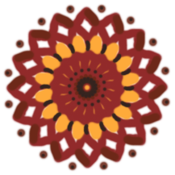
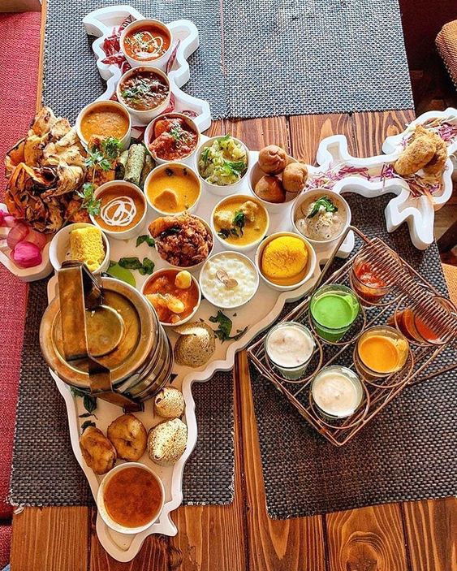

<h1 align="center"> Dawat-e-Hindustan</h1>

<i>
From Chole bhature of Dehli to Dosa of South, 
From Rosogolla of to Biryani of Hyderabad, 
From Lassi of Punjab Bengal to Dhokla of Gujarat, 
From Vada pav of Mumbai to Puchka of Kolkata, 
From Dal bati churma of Rajasthan to Litti chokha of Bihar, 
India is all about mouth watering cuisines. 
</i> 

 

<b>No wonder why Indian cuisine always tops the foodies list worldwide. And these are not just food but the emotions of people. Experience that Maa ke haath ka swaad in every bite!</b>

<h3 align="center">So, Dawat-e-Hindustan is a restaurant page which promotes Indian flavours and cusines.</h3>

 

<!---->
